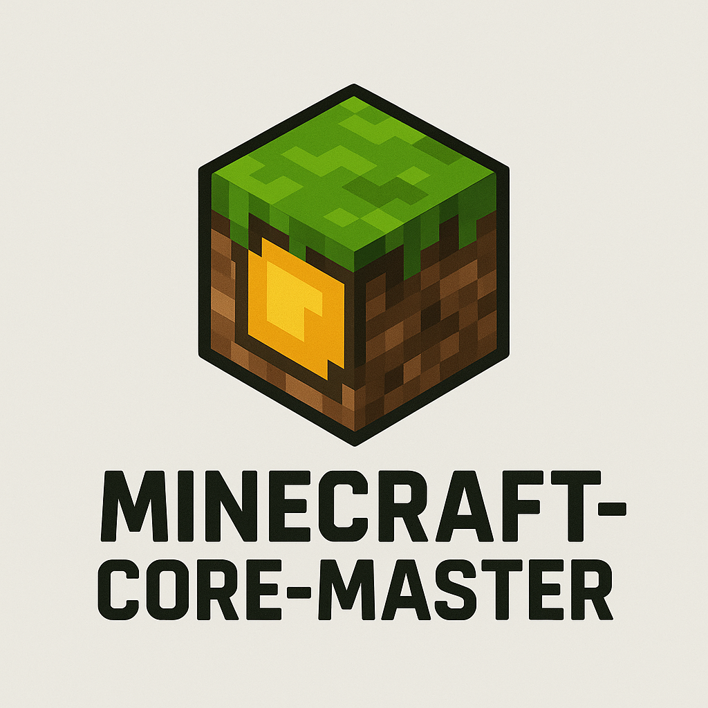
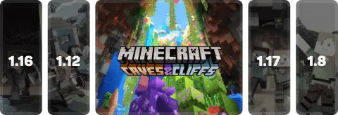
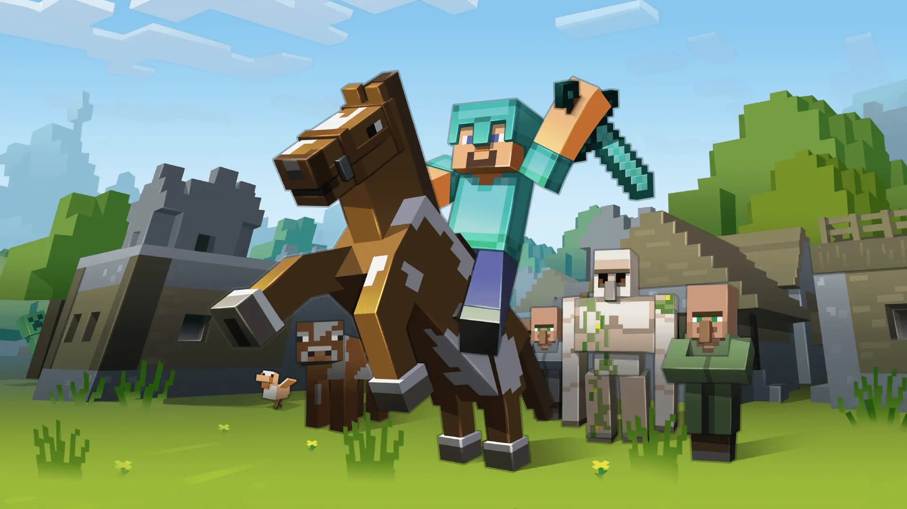

[](https://www.npmjs.com/package/minecraft-core-master)
[](https://www.npmjs.com/package/minecraft-core-master)

# Minecraft-Core-Master

**Minecraft-Core-Master** es un conjunto modular escrito en JavaScript que permite descargar, instalar y ejecutar cualquier versión de Minecraft directamente desde los servidores oficiales de Mojang. Su arquitectura basada en eventos lo hace ideal para integrarse en **launchers personalizados** (como los desarrollados en **Electron**), con feedback visual de progreso y errores en tiempo real.

Desarrollado por **NovaStep Studios** con un enfoque en rendimiento, control total, personalización y compatibilidad total con versiones *legacy*, *modernas* y con modloaders populares.

Soporte : [StepLauncher](https://discord.gg/YAqpTWQByM)

<!-- Documentacion / Docs : [Minecraft-Core-Master-Docs](https://minecraft-core-master.web.app/) -->

## Apoyar

Mercado Pago :
 - CVU : 0000003100051190149138
 - Alias : stepnickasantiago

---
## Instalacion

Instalacion `npm i minecraft-core-master`

Dependencias que utiliza : **node-fetch, p-limit, tar, unzipper, cheerio, uuid, open, minecraft-auth**
❤ Gracias a Minecraft-Auth para el login a microsoft, mojang, cracked, mas facilmente!

## 🚀 Componentes principales


### 🧩 `MinecraftDownloader`



Clase que descarga todos los recursos necesarios para ejecutar Minecraft:

* 🔧 Java Runtime (JVM) oficial o personalizado.
* 📦 Librerías del juego.
* 🎨 Assets (texturas, sonidos, fuentes, etc.).
* 🧠 `client.jar`.
* 💻 Archivos nativos específicos para tu sistema operativo.

#### 🧪 Uso básico

```js
const {MinecraftDownloader} = require("minecraft-core-master");

const Download = new MinecraftDownloader();

Download.on("progress", ({ current, stepPercent, totalPercent }) => {
  console.log(`🔄 ${current}: ${stepPercent}% | Total: ${totalPercent}%`);
});

Download.on("step-done", name => {
  console.log(`✅ ${name} completado.`);
});

Download.on("done", () => {
  console.log("🎉 Todo listo para lanzar el juego!");
});

Download.on("error", err => {
  console.error("❌ Error:", err.message);
});

Download.downloadAll("./.minecraft", "1.12.2", false, true);
```
#### 🔧 Constructor

| Parámetro        | Tipo       | Descripción                                                                 |
|------------------|------------|-----------------------------------------------------------------------------|
| `root`           | `string`   | Ruta base donde se descargará e instalará Minecraft.                        |
| `version`        | `string`   | Versión de Minecraft a instalar (ej: `"1.12.2"`).                           |
| `downloadJava`   | `boolean`  | Si se debe descargar Java (`true`) o no (`false`), elige Java especifico (`Java20`, `Java24`,`Java17`).                          |
| `fastMode`       | `boolean`  | Si se debe activar el modo rápido (descarga todo sin pasos intermedios).   |


#### 📡 Eventos

* `"progress"` → Estado textual en tiempo real.
* `"done"` → Descarga finalizada correctamente.
* `"error"` → Fallos críticos o interrupciones.

---

### 🛠️ `MinecraftLoaders`

Instala modloaders como **Forge**, **OptiFine**, **NeoForge**, **Quilt**, **Fabric**, sobre una instalación existente de Minecraft.

#### 📦 Ejemplo de uso

```js
const {MinecraftLoaders} = require('minecraft-core-master');

const installer = new MinecraftLoaders().neoforge({
  root: '.minecraft',        // Ruta a la carpeta raíz
  version: '21.4.0-beta'     // Versión de NeoForge
});

installer.on('data', (msg) => {
  console.log(`[NeoForge] ${msg}`);
});

installer.on('done', () => {
  console.log("✅ NeoForge instalado correctamente.");
});

installer.on('error', (err) => {
  console.error("❌ Error durante la instalación:", err);
});
```

```js
const {MinecraftLoaders} = require('minecraft-core-master');

new MinecraftLoaders().forge({
  root: './.minecraft',
  version: '1.16.5-36.2.20',
})
  .on('data', (msg) => {
    console.log(`[Forge] Progreso: ${msg.progress}/${msg.total}`);
  })
  .on('done', () => {
    console.log('[Forge] Instalación completada');
  })
  .on('error', console.error);
```

Otros modloaders: Fabric, LegacyFabric, Quilt, Neoforge.

Puedes ver ejemplos en la carpeta de pruebas:
[TestLoaders](https://github.com/NovaStepStudios/Minecraft-Core-Master/tree/main/test/Loaders)

#### ℹ️ Notas

* La carpeta `root` debe contener una instalación válida de Minecraft.
* Requiere **Java en PATH** para instalar Forge.
* No descarga Minecraft base, solo inyecta el modloader deseado.

---

### 🎮 `MinecraftExecutor`


Clase que permite **lanzar Minecraft** con control total: configuración de memoria, ruta Java, ventana, argumentos, y sistema de logs y errores con persistencia.

#### 🚀 Ejemplo práctico ( Basico )

```js
const { MinecraftExecutor } = require('minecraft-core-master');

const Launcher = new MinecraftExecutor();

Launcher.start({
  root: './.minecraft',
  javaPath: 'C:/Program Files/Java/jre1.8.0_451/bin/javaw.exe', // O simplemente 'java' si está en el PATH
  memory: { max: '6G', min: '1G' },
  version: { versionID: '1.12.2-forge-14.23.5.2860', type: 'release' },
  client: { username: 'SantiagoStepnicka012' },
  demo: false,  // Modo Demo activado (false por defecto)
  debug: true,  // Logs detallados activados
});

// Escuchar eventos importantes
Launcher.on('debug', console.log);
Launcher.on('error', console.error);
Launcher.on('close', (code) => {
  console.log(`⚠️ Java se cerró con código: ${code}`);
});

```
---

### 😎 Ejemplo práctico (Avanzado)

```js
const { MinecraftExecutor } = require('minecraft-core-master');
const path = require('path');

const Launcher = new MinecraftExecutor();

const opts = {
  root: './.minecraft',
  javaPath: 'C:/Program Files/Java/jre1.8.0_451/bin/javaw.exe',
  memory: {
    max: '6G',
    min: '1G',
  },
  version: {
    versionID: '1.12.2-forge-14.23.5.2860',
    type: 'release',
  },
  client: {
    username: 'SantiagoStepnicka012',
    password: 'xxx_Santiago_xxx', // Opcional
    provider: 'microsoft', // 'microsoft' | 'mojang' | 'legacy'
    email: 'example@gmail.com', // Opcional, para Microsoft
    appID: 'xxxxxxxx-xxxx-xxxx-xxxx-xxxxxxxxxxxx', // AZURE APP ID
    appSecret: 'xxxxxxxxxxxxxxxxxxxxxxxxxxxxxxxx', // AZURE APP SECRET
    mode: 'native', // 'native' | 'web' (Minecraft-Auth)
  },
  demo: false,
  debug: true,
  jvmFlags: ['-XX:+UseG1GC', '-Dfml.ignoreInvalidMinecraftCertificates=true'],
  mcFlags: ['--forceUpgrade'],
};

Launcher.start(opts);

// Eventos
Launcher.on('debug', msg => console.log(`🟢 [DEBUG] ${msg}`));
Launcher.on('error', err => console.error(`❌ [ERROR] ${err}`));
Launcher.on('started', ({ auth, opts, versionData }) => {
  console.log(`✅ Minecraft iniciado como ${auth.name} (Versión: ${versionData.id})`);
});
Launcher.on('close', (code) => {
  console.log(`⚠️ Java cerrado con código: ${code}`);
});
```

---

### ⚙️ Argumentos disponibles en `start(opts)`

| Campo       | Tipo                                                                                                                            | Descripción                                                               | Ejemplo / Notas                                                                                          |
| ----------- | ------------------------------------------------------------------------------------------------------------------------------- | ------------------------------------------------------------------------- | -------------------------------------------------------------------------------------------------------- |
| `root`      | `string`                                                                                                                        | Carpeta raíz donde se almacenarán los datos del juego.                    | `'./.minecraft'`                                                                                         |
| `javaPath`  | `string`                                                                                                                        | Ruta al ejecutable de Java (`java` o `javaw.exe`).                        | `'C:/Program Files/Java/jdk-17/bin/javaw.exe'` o `'java'`                                                |
| `memory`    | `{ min: string, max: string }`                                                                                                  | Cantidad de RAM a usar.                                                   | `{ min: '1G', max: '4G' }`                                                                               |
| `window`    | `{ width: number, height: number, fullscreen: boolean }`                                                                        | Configura tamaño de ventana y modo pantalla completa.                     | `{ width: 1280, height: 720, fullscreen: false }`                                                        |
| `version`   | `{ versionID: string, type: string }`                                                                                           | Versión de Minecraft a iniciar.                                           | `{ versionID: '1.20.1', type: 'release' }`                                                               |
| `client`    | `{ username: string, password?: string, provider?: string, email?: string, appID?: string, appSecret?: string, mode?: string }` | Datos de la cuenta o perfil offline y método de login.                    | `provider` puede ser `'microsoft'`, `'mojang'`, `'legacy'`. `mode` para Microsoft: `'native'` o `'web'`. |
| `jvmFlags`  | `string[]`                                                                                                                      | Argumentos avanzados para la JVM (rendimiento, compatibilidad, debug).    | `['-XX:+UseG1GC', '-Dfml.ignoreInvalidMinecraftCertificates=true']`                                      |
| `mcFlags`   | `string[]`                                                                                                                      | Argumentos adicionales para Minecraft (ej: `--forceUpgrade`, `--server`). | `['--forceUpgrade']`                                                                                     |
| `overrides` | `{ assetsDir?: string, gameDir?: string, librariesDir?: string }`                                                               | Sobrescribe rutas personalizadas para carpetas internas del juego.        | `{ assetsDir: './custom-assets', gameDir: './profiles/Santi' }`                                          |
| `demo`      | `boolean`                                                                                                                       | Activa el modo demo de Minecraft.                                         | `true` o `false`                                                                                         |
| `debug`     | `boolean`                                                                                                                       | Activa los logs detallados de cada paso.                                  | `true` o `false`                                                                                         |

---

> **Nota:** Este proyecto soporta el lanzamiento y gestión de **todas las versiones oficiales de Minecraft**, desde las más recientes hasta las más antiguas, incluyendo snapshots, betas, alphas y versiones históricas como la legendaria **rd-132211**. No importa qué tan vintage o moderna sea la versión, Minecraft-Core-Master la ejecutará con total estabilidad y rendimiento.

---

### 📁 Gestión avanzada de logs y errores

* Los logs críticos y reportes de fallos se almacenan automáticamente en la carpeta `root/logs` bajo archivos con prefijo `minecraft-core-master*.log`, permitiendo una inspección detallada para diagnósticos rápidos y precisos.
* Toda la salida estándar (`stdout`) y salida de error (`stderr`) del proceso Minecraft se expone en tiempo real a través de eventos, lo que facilita la integración con GUIs personalizadas, consolas o herramientas de monitoreo remoto.
* La arquitectura basada en eventos permite capturar errores de manera proactiva y reaccionar ante ellos sin bloquear el flujo del programa, garantizando una experiencia estable para el usuario final.
* Configurar Microsoft Azure, descarga el repositorio y crea un archivo .env en "components/launch/authenticator/" crea un archivo .env sin nombre solo .env, y coloca [MS_CLIENT_ID=`Tu Client ID de Azure`, MS_CLIENT_SECRET=`Cliente Secreto de Azure`]

---

## 📜 Scripts de prueba y demostración (github)

Incluimos ejemplos robustos en la carpeta `test/` para que puedas probar cada componente de forma independiente o integrada. Estos scripts incluyen manejo de eventos detallado, seguimiento de progreso y captura de errores:

```bash
node test/Download.js      # Descarga y prepara cualquier versión de Minecraft con validación.
node test/Start.js        # Ejecuta Minecraft con configuración avanzada y monitoreo. En Mantenimiento
```

Estos ejemplos sirven tanto para pruebas rápidas como para entender cómo extender o integrar Minecraft-Core-Master en tus proyectos.



---

## 🧪 Características técnicas sobresalientes

* 🔒 **Descarga 100% oficial y segura:** Se obtienen todos los archivos directamente desde los servidores de Mojang con validación de integridad mediante hash, asegurando que nada sea modificado o corrupto.
* 🔄 **Compatibilidad universal:** Soporte completo para **todas las versiones oficiales** de Minecraft, incluyendo versiones históricas, snapshots, betas, alphas y cualquier versión custom que respete el formato oficial.
* 🧩 **Arquitectura modular y extensible:** Componentes diseñados para ser reutilizables, escalables y fáciles de integrar en launchers personalizados o proyectos propios, con eventos claros y documentación completa.
* ⚡ **Eventos en tiempo real:** Gracias al uso intensivo de `EventEmitter`, la integración con interfaces gráficas o consolas avanzadas es simple y poderosa, permitiendo reportar estados, errores y progreso dinámicamente.
* 🌍 **Multiplataforma real:** Comprobado en Linux, Windows y macOS, garantizando que tu launcher o proyecto corra sin problemas en cualquiera de estos sistemas operativos, con manejo automático de nativos.
* 💻 **Soporte para modloaders y versiones custom:** Compatible con Forge, Fabric, NeoForge, Optifine, Quilt, Battly Client y BatMod, facilitando lanzar prácticamente cualquier configuración de Minecraft sin dolores de cabeza.

---

## 🏢 Acerca de NovaStep Studios

**Minecraft-Core-Master** es el resultado de la pasión y dedicación de **Santiago Stepnicka (Stepnicka)**, un desarrollador fullstack comprometido con el software libre, la modularidad y la excelencia técnica.

🎯 **Nuestra misión:** Empoderar a desarrolladores y comunidades con herramientas profesionales, robustas y abiertas para transformar la forma en que se juega y se lanza Minecraft. Lanzar Minecraft no debe ser un dolor de cabeza; debe ser una experiencia fluida, personalizable y con control total.

---

¿Querés dar el siguiente paso y crear tu propio launcher personalizado? ¿Necesitás ayuda con ejemplos avanzados, integración en React/Electron o incluso un sistema de mods? Solo decime y te armo lo que necesites.

---
