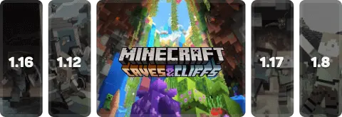
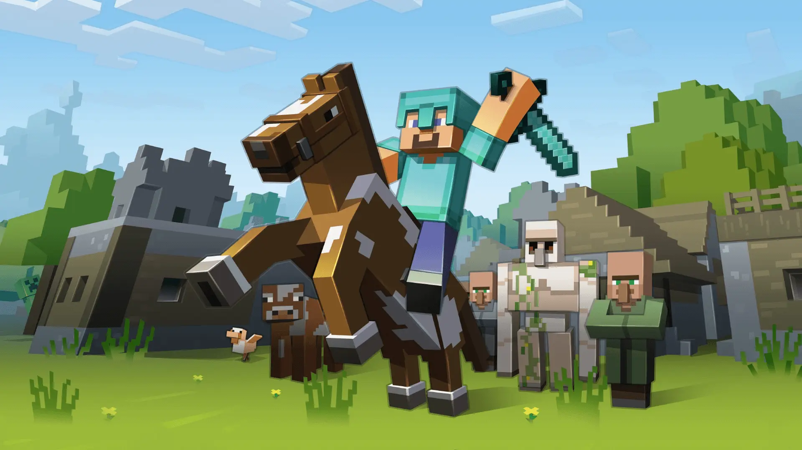

# Minecraft-Core-Master

**Minecraft-Core-Master** es un conjunto modular escrito en JavaScript que permite descargar, instalar y ejecutar cualquier versión de Minecraft directamente desde los servidores oficiales de Mojang. Su arquitectura basada en eventos lo hace ideal para integrarse en **launchers personalizados** (como los desarrollados en **Electron**), con feedback visual de progreso y errores en tiempo real.

Desarrollado por **NovaStep Studios** con un enfoque en rendimiento, control total, personalización y compatibilidad total con versiones *legacy*, *modernas* y con modloaders populares.

Soporte : [StepLauncher](https://discord.gg/YAqpTWQByM)

---
## Instalacion

Instalacion `npm i minecraft-core-master`

Dependencias que utiliza : **node-fetch, p-limit, tar, unzipper, uuid**


## 🚀 Componentes principales


### 🧩 `MinecraftDownloader`



Clase que descarga todos los recursos necesarios para ejecutar Minecraft:

* 🔧 Java Runtime (JVM) oficial o personalizado.
* 📦 Librerías del juego.
* 🎨 Assets (texturas, sonidos, fuentes, etc.).
* 🧠 `client.jar`.
* 💻 Archivos nativos específicos para tu sistema operativo.

#### 🧪 Uso básico

```js
const MinecraftDownloader = require("../components/downloader/main");

const Download = new MinecraftDownloader();

Download.on("progress", ({ current, stepPercent, totalPercent }) => {
  console.log(`🔄 ${current}: ${stepPercent}% | Total: ${totalPercent}%`);
});

Download.on("step-done", name => {
  console.log(`✅ ${name} completado.`);
});

Download.on("done", () => {
  console.log("🎉 Todo listo para lanzar el juego!");
});

Download.on("error", err => {
  console.error("❌ Error:", err.message);
});

Download.downloadAll("./.minecraft", "1.12.2", false, true);
```
#### 🔧 Constructor

| Parámetro        | Tipo       | Descripción                                                                 |
|------------------|------------|-----------------------------------------------------------------------------|
| `root`           | `string`   | Ruta base donde se descargará e instalará Minecraft.                        |
| `version`        | `string`   | Versión de Minecraft a instalar (ej: `"1.12.2"`).                           |
| `downloadJava`   | `boolean`  | Si se debe descargar Java (`true`) o no (`false`).                          |
| `fastMode`       | `boolean`  | Si se debe activar el modo rápido (descarga todo sin pasos intermedios).   |


#### 📡 Eventos

* `"progress"` → Estado textual en tiempo real.
* `"done"` → Descarga finalizada correctamente.
* `"error"` → Fallos críticos o interrupciones.

---

### 🛠️ `LoaderInstaller`

Instala modloaders como **Forge**,**OptiFine**,**NeoForge**,**Quilt**,**Fabric**, sobre una instalación existente de Minecraft.

#### 📦 Ejemplo de uso

```js
const { LoaderInstaller } = require("minecraft-core-master");

const installer = new LoaderInstaller("./Minecraft", "1.20.4-forge-47.2.0", "Forge");

installer.on("progress", (msg) => console.log("[Progreso]", msg));
installer.on("done", (msg) => console.log("[✔]", msg));
installer.on("error", (err) => console.error("[❌]", err));

installer.start()
  .then(() => console.log("✅ Instalación completada"))
  .catch((err) => console.error("❌ Error crítico:", err));
```

#### ℹ️ Notas

* La carpeta `destDir` debe tener una instalación válida de Minecraft.
* Requiere **Java en PATH** para instalar Forge.
* No descarga Minecraft base, solo inyecta el modloader deseado.
---

### 🎮 `MinecraftExecutor`


Clase que permite **lanzar Minecraft** con control total: configuración de memoria, ruta Java, ventana, argumentos, y sistema de logs y errores con persistencia.

#### 🚀 Ejemplo práctico

```js
const { spawn } = require('child_process');
const MinecraftExecutor = require('minecraft-core-master/components/launch');

const Launcher = new MinecraftExecutor();

const opts = {
  root: './.minecraft',
  javaPath: 'C:/Program Files/Java/jre1.8.0_451/bin/javaw.exe' || 'java',
  memory: {
    max: '6G',
    min: '1G',
  },
  version: {
    versionID: '1.12.2-forge-14.23.5.2860',
    type: 'release',
  },
  client: {
    username: 'SantiagoStepnicka012',
    password: 'xxx_Santiago_xxx', // Opcional, para servidores que lo requieran
  },
  demo: false,  // Habilitar modo demo
  debug: true,  // Mostrar logs detallados
};

Launcher.start(opts);

Launcher.on('debug', console.log);
Launcher.on('error', console.error);

Launcher.on('ready', ({ args, opts }) => {
  const child = spawn(opts.javaPath, args, {
    stdio: 'inherit',
  });
  child.on('close', (code) => console.log(`⚠️ Java cerrado con código ${code}`));
});
```

#### ⚙️ Argumentos disponibles en `start(opts)`

| Campo       | Tipo                                                     | Descripción                                                     |
| ----------- | -------------------------------------------------------- | --------------------------------------------------------------- |
| `root`      | `string`                                                 | Carpeta raíz del juego.                                         |
| `javaPath`  | `string`                                                 | Ruta a `java` (opcional, se autodetecta si no está).            |
| `memory`    | `{ min: string, max: string }`                           | Memoria asignada (ej: `"1G"`, `"6G"`).                          |
| `window`    | `{ width: number, height: number, fullscreen: boolean }` | Tamaño y modo de ventana del juego.                             |
| `version`   | `{ versionID: string, type: string }`                    | Versión de Minecraft a lanzar.                                  |
| `client`    | `{ username: string, password?: string }`                | Usuario Mojang u offline; password opcional para servidores.    |
| `jvm`       | `string[]`                                               | Argumentos JVM adicionales.                                     |
| `mcArgs`    | `string[]`                                               | Argumentos adicionales para Minecraft.                          |
| `overrides` | `object`                                                 | Sobrescribe directorios como `assetsDir`, `gameDirectory`, etc. |
| `demo`      | `boolean`                                                | Activa modo demo.                                               |
| `debug`     | `boolean`                                                | Muestra logs detallados.                                        |

---

## Supported versions / Versiones soportadas

| Versión / Cliente | ¿Soportada? |
| ----------------- | ----------- |
| **Vanilla**       | ✅ Sí        |
| **Forge**         | ✅ Sí        |
| **Optifine**      | ✅ Sí        |
| **NeoForge**      | ✅ Sí        |
| **Fabric**        | ✅ Sí        |
| **Quilt**         | ✅ Sí        |
| **Battly Client** | ✅ Sí        |
| **BatMod**        | ✅ Sí        |

> **Nota:** Este proyecto soporta el lanzamiento y gestión de **todas las versiones oficiales de Minecraft**, desde las más recientes hasta las más antiguas, incluyendo snapshots, betas, alphas y versiones históricas como la legendaria **rd-132211**. No importa qué tan vintage o moderna sea la versión, Minecraft-Core-Master la ejecutará con total estabilidad y rendimiento.

---

### 📁 Gestión avanzada de logs y errores

* Los logs críticos y reportes de fallos se almacenan automáticamente en la carpeta `root/temp/` bajo archivos con prefijo `mc_crash*.log`, permitiendo una inspección detallada para diagnósticos rápidos y precisos.
* Toda la salida estándar (`stdout`) y salida de error (`stderr`) del proceso Minecraft se expone en tiempo real a través de eventos, lo que facilita la integración con GUIs personalizadas, consolas o herramientas de monitoreo remoto.
* La arquitectura basada en eventos permite capturar errores de manera proactiva y reaccionar ante ellos sin bloquear el flujo del programa, garantizando una experiencia estable para el usuario final.

---

## 📜 Scripts de prueba y demostración

Incluimos ejemplos robustos en la carpeta `examples/` para que puedas probar cada componente de forma independiente o integrada. Estos scripts incluyen manejo de eventos detallado, seguimiento de progreso y captura de errores:

```bash
node examples/MinecraftDownloader.js      # Descarga y prepara cualquier versión de Minecraft con validación.
node examples/MinecraftExecutor.js        # Ejecuta Minecraft con configuración avanzada y monitoreo.
node examples/LoaderInstaller.js          # Instala modloaders y versiones personalizadas (mods/loaders). En Mantenimiento
```

Estos ejemplos sirven tanto para pruebas rápidas como para entender cómo extender o integrar Minecraft-Core-Master en tus proyectos.



---

## 🧪 Características técnicas sobresalientes

* 🔒 **Descarga 100% oficial y segura:** Se obtienen todos los archivos directamente desde los servidores de Mojang con validación de integridad mediante hash, asegurando que nada sea modificado o corrupto.
* 🔄 **Compatibilidad universal:** Soporte completo para **todas las versiones oficiales** de Minecraft, incluyendo versiones históricas, snapshots, betas, alphas y cualquier versión custom que respete el formato oficial.
* 🧩 **Arquitectura modular y extensible:** Componentes diseñados para ser reutilizables, escalables y fáciles de integrar en launchers personalizados o proyectos propios, con eventos claros y documentación completa.
* ⚡ **Eventos en tiempo real:** Gracias al uso intensivo de `EventEmitter`, la integración con interfaces gráficas o consolas avanzadas es simple y poderosa, permitiendo reportar estados, errores y progreso dinámicamente.
* 🌍 **Multiplataforma real:** Comprobado en Linux, Windows y macOS, garantizando que tu launcher o proyecto corra sin problemas en cualquiera de estos sistemas operativos, con manejo automático de nativos.
* 💻 **Soporte para modloaders y versiones custom:** Compatible con Forge, Fabric, NeoForge, Optifine, Quilt, Battly Client y BatMod, facilitando lanzar prácticamente cualquier configuración de Minecraft sin dolores de cabeza.

---

## 🏢 Acerca de NovaStep Studios

**Minecraft-Core-Master** es el resultado de la pasión y dedicación de **Santiago Stepnicka (Stepnicka)**, un desarrollador fullstack comprometido con el software libre, la modularidad y la excelencia técnica.

🎯 **Nuestra misión:** Empoderar a desarrolladores y comunidades con herramientas profesionales, robustas y abiertas para transformar la forma en que se juega y se lanza Minecraft. Lanzar Minecraft no debe ser un dolor de cabeza; debe ser una experiencia fluida, personalizable y con control total.

---

¿Querés dar el siguiente paso y crear tu propio launcher personalizado? ¿Necesitás ayuda con ejemplos avanzados, integración en React/Electron o incluso un sistema de mods? Solo decime y te armo lo que necesites.

---
