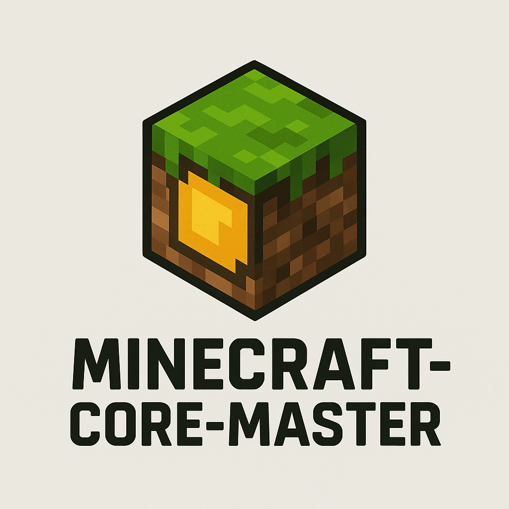

# Minecraft-Core-Master

<<<<<<< HEAD
**Minecraft-Core-Master** es una clase JavaScript para descargar versiones oficiales de Minecraft directamente desde los servidores de Mojang. Gestiona la descarga de:

* La versión específica de Minecraft (release, snapshot, old\_beta, old\_alpha, etc.)
* Librerías necesarias
* Assets (recursos gráficos y sonidos)
* Archivos nativos para el sistema operativo actual (Windows, Linux, macOS)
* Instalación opcional de Java (JVM)

Está diseñado para usarse en entornos Node.js, especialmente con Electron, usando eventos para informar progreso y errores, facilitando su integración en interfaces gráficas.

**Creado por:** NovaStep Studios — Desarrollo enfocado en mejorar la experiencia de usuario en apps Electron.

---

## Ejemplo básico: Descargar Minecraft
=======
**Minecraft-Core-Master** es un conjunto de módulos JavaScript para gestionar completamente la descarga y ejecución de versiones oficiales de Minecraft directamente desde los servidores de Mojang. Está pensado para ser usado en entornos Node.js, especialmente con Electron, y facilita la creación de launchers personalizados mediante eventos que informan progreso, logs y errores en tiempo real.

Desarrollado por NovaStep Studios para ofrecer una experiencia de usuario potente, modular y adaptable.

---

## Componentes Principales

### MinecraftDownloader

Clase que orquesta la descarga secuencial y ponderada de todos los elementos necesarios para ejecutar Minecraft:

- JVM (Java Runtime) opcional para la versión requerida.
- Librerías necesarias para la versión seleccionada.
- Assets (texturas, sonidos, etc.).
- Cliente (archivo `.jar` principal de Minecraft).
- Archivos nativos específicos para el sistema operativo (Windows, Linux, macOS).

#### Uso Básico
>>>>>>> d78a581 (Update All Project)

```js
const path = require("path");
const { MinecraftDownloader } = require("minecraft-core-master");

const downloadPath = path.join(__dirname, "minecraft");
<<<<<<< HEAD
const downloader = new MinecraftDownloader(downloadPath, true, "release");

downloader.on("progress", (msg) => console.log("[PROGRESO]", msg));
downloader.on("error", (err) => console.error("[ERROR]", err));
downloader.on("done", (msg) => console.log("[COMPLETADO]", msg));

downloader.download(); // Descarga la última versión release
```

---

## Parámetros de `new MinecraftDownloader(path, autoInstallJava, versionType)`

| Parámetro         | Tipo      | Obligatorio | Descripción                                                                                   |
| ----------------- | --------- | ----------- | --------------------------------------------------------------------------------------------- |
| `path`            | `string`  | Sí          | Ruta absoluta o relativa para instalar Minecraft, e.g. `"./minecraft"`.                       |
| `autoInstallJava` | `boolean` | Sí          | Si es `true`, instala automáticamente Java si no existe. Si `false`, se asume que Java está.  |
| `versionType`     | `string`  | Sí          | Tipo de versión por defecto para `.download()`: `"release"`, `"snapshot"`, `"old_beta"`, etc. |

---

## Métodos

### `.download(version?: string): Promise<void>`

* `version` (opcional): versión específica para descargar. Si se omite, descarga la última del tipo configurado.
* Devuelve una promesa que resuelve al terminar la descarga.

---

## Eventos disponibles

| Evento       | Parámetros | Descripción                                                 |
| ------------ | ---------- | ----------------------------------------------------------- |
| `"progress"` | `string`   | Estado actual del proceso: descarga de librerías, assets... |
| `"error"`    | `Error`    | Error ocurrido durante la descarga                          |
| `"done"`     | `string`   | Descarga completada exitosamente                            |

---

# Ejecutar Minecraft con `MinecraftEjecuting`

Además de descargar, el paquete permite lanzar Minecraft con la clase `MinecraftEjecuting`.

## Ejemplo básico para lanzar Minecraft

```js
const { MinecraftEjecuting } = require("minecraft-core-master");
const launcher = new MinecraftEjecuting();

const opts = {
  root: "./Minecraft",
  javaPath: "java",
  memory: { max: "6G", min: "1G" },
  window: { width: 854, height: 480, fullscreen: false },
  version: { versionID: "1.9", type: "release" },
  user: {
    name: "xxx_MataAbuelitas3000_xxx",
    skinPath: "./skin.png",
    capaPath: "./cape.png",
  },
};

launcher.launch(opts);

launcher.on("debug", (e) => console.log("[DEBUG]", e));
launcher.on("data", (e) => console.log("[DATA]", e));
=======
const downloader = new MinecraftDownloader(downloadPath, "Java17" /** Java17 ,Java20, Java24 */, "release");

downloader.on("progress", (msg) => console.log("[PROGRESO]", msg));
downloader.on("error", (err) => console.error("[ERROR]", err));

(async () => {
  try {
    await downloader.start("1.20.4");  // Versión Minecraft a descargar
    console.log("Descarga completa.");
  } catch (e) {
    console.error("Fallo en la descarga:", e);
  } 
})();
```
#### Constructor

| Parámetro  | Tipo     | Descripción                                                     |
| ---------- | -------- | --------------------------------------------------------------- |
| `rootPath` | `string` | Directorio raíz donde se instalará Minecraft y sus componentes. |
| `javaVer`  | `string` | Versión de Java requerida (ej: `"Java17"`).                     |
| `release`  | `string` | Tipo de versión: `"release"`, `"snapshot"`, `"old_beta"`, etc.  |

#### Eventos

* `"progress"`: Mensajes de estado y porcentaje de progreso global.
* `"error"`: Errores durante el proceso.

---
### CustomInstaller

**CustomInstaller** es una clase para instalar mods populares de Minecraft (Forge u OptiFine) en una ruta personalizada. No descarga Minecraft base, solo instala el mod correspondiente.


#### Uso

```js
const { CustomInstaller } = require("minecraft-core-master");

// Crear una instancia:
// Parámetros:
//   1) destDir: Ruta donde se instalará Minecraft y el mod (ej: "./Minecraft")
//   2) version: Versión de Minecraft o del mod (ej: "1.21.6-56.0.7")
//   3) modType: Tipo de mod a instalar, "Forge" o "Optifine"

const installer = new CustomInstaller("./Minecraft", "1.21.6-56.0.7", "Forge");

installer.on("progress", (data) => {
  console.log("[Progreso]", data);
});

installer.on("done", (msg) => {
  console.log("[✔]", msg);
});

installer.on("error", (err) => {
  console.error("[❌]", err);
});

// Iniciar la instalación
installer.start()
  .then(() => console.log("✅ Instalación completada"))
  .catch((err) => console.error("❌ Error crítico:", err));
>>>>>>> d78a581 (Update All Project)
```

---

<<<<<<< HEAD
## Parámetros de configuración para `launch(opts)`

| Propiedad  | Descripción                                  | Tipo                                                      | Obligatorio |
| ---------- | -------------------------------------------- | --------------------------------------------------------- | ----------- |
| `root`     | Ruta base de instalación de Minecraft        | `string`                                                  | Sí          |
| `javaPath` | Ruta al ejecutable Java (java o javaw)       | `string`                                                  | Sí          |
| `memory`   | Memoria mínima y máxima para JVM             | `{ min: string, max: string }`                            | No          |
| `window`   | Configuración de ventana                     | `{ width: number, height: number, fullscreen: boolean }`  | No          |
| `version`  | Versión y tipo de Minecraft a ejecutar       | `{ versionID: string, type: string }`                     | Sí          |
| `user`     | Información opcional de usuario (skin, capa) | `{ name?: string, skinPath?: string, capaPath?: string }` | No          |

---

## Eventos de `MinecraftEjecuting`

| Evento  | Parámetros | Descripción                        |
| ------- | ---------- | ---------------------------------- |
| `debug` | `string`   | Información detallada de ejecución |
| `data`  | `string`   | Datos adicionales durante el juego |

---

# Resumen técnico

* Obtiene versiones desde el manifiesto oficial de Mojang.
* Descarga client.jar, librerías, assets y nativos según versión y OS.
* Compatible con Windows, Linux y macOS, detectando el sistema automáticamente.
* Extrae archivos comprimidos (.zip, .tar.gz).
* Instala Java automáticamente si se configura.
* Permite personalizar memoria, ventana, versión y usuario al lanzar.
* Utiliza eventos para progreso, datos y errores.
* Próximamente soporte para modloaders como Forge, NeoForge, Fabric y OptiFine.

---

#### NovaStep Studios — Innovando la experiencia Minecraft en Electron
=======
#### Eventos emitidos

* `"progress"` — Información del progreso con `{ step, message }`
* `"done"` — Cuando termina exitosamente, con `{ message }`
* `"error"` — Si ocurre algún error, con el objeto `Error`


#### Notas

* La ruta `destDir` debe ser la carpeta donde querés instalar Minecraft y el mod.
* El mod instalado depende del parámetro `modType` ("Forge" o "Optifine").
* El instalador asume que Java está instalado y en el PATH (requerido para Forge).
* No descarga Minecraft base, solo instala el mod.

---

### MinecraftExecutor

Clase para lanzar una instancia de Minecraft ya descargada con total control y personalización. Se encarga de:

* Validar y configurar Java (ruta, flags JVM, memoria).
* Resolver y verificar la versión de Minecraft.
* Gestionar assets, librerías y nativos necesarios.
* Construir el classpath y argumentos para el proceso de Minecraft.
* Emitir logs stdout y stderr en tiempo real.
* Guardar logs de errores/crashes automáticamente.

#### Uso Básico

```js
const { MinecraftExecutor } = require("minecraft-core-master");

(async () => {
  const executor = new MinecraftExecutor();

  await executor.start({
    root: "/ruta/a/minecraft",
    javaPath: "java",
    memory: { max: "4G", min: "2G" },
    window: { width: 1280, height: 720, fullscreen: false },
    version: { versionID: "1.20.1", type = "release" /** Forge, Optifine, NeoForge, Quilt, etc */ },
    user: {
      name: "Player123",
      uuid: "uuid-del-jugador",
      accessToken: "token-de-acceso",
    },
    jvm: ["-XX:+UseConcMarkSweepGC"], // Opcional
    mcArgs: ["--demo"], // Opcional
    debug: true, // Opcional
  });

  executor.on("data", (data) => console.log("[MC STDOUT]", data));
  executor.on("error", (err) => console.error("[MC STDERR]", err));
  executor.on("close", (code) => console.log("Minecraft cerrado con código", code));
})();
```

#### Método `start(opts)`

| Propiedad   | Tipo                                                                 | Descripción                                                    |
| ----------- | -------------------------------------------------------------------- | -------------------------------------------------------------- |
| `root`      | `string`                                                             | Carpeta raíz con versiones, librerías, assets, etc.            |
| `javaPath`  | `string`                                                             | Ruta o nombre del ejecutable Java.                             |
| `memory`    | `{ max: string, min: string }`                                       | Memoria máxima y mínima asignada a la JVM.                     |
| `window`    | `{ width: number, height: number, fullscreen: boolean }`             | Configuración de la ventana Minecraft.                         |
| `overrides` | `object`                                                             | Opciones para sobrescribir directorios (e.g. `gameDirectory`). |
| `jvm`       | `string[]`                                                           | Flags extra para JVM.                                          |
| `mcArgs`    | `string[]`                                                           | Argumentos extra para Minecraft.                               |
| `version`   | `{ versionID: string }`                                              | Información de la versión de Minecraft.                        |
| `user`      | `{ name: string, uuid: string, accessToken: string, type?: string }` | Datos de usuario autenticado.                                  |
| `debug`     | `boolean`                                                            | Mostrar logs detallados para depuración.                       |

#### Eventos Emitidos

* `"data"`: mensajes stdout.
* `"error"`: mensajes stderr.
* `"close"`: código de salida del proceso.

---

## Requisitos

* Node.js v18+ (uso de Promesas y módulos modernos).
* Java instalado o con ruta configurada.
* Estructura de directorios correcta para Minecraft.
* Datos válidos de usuario con token de acceso.
>>>>>>> d78a581 (Update All Project)
