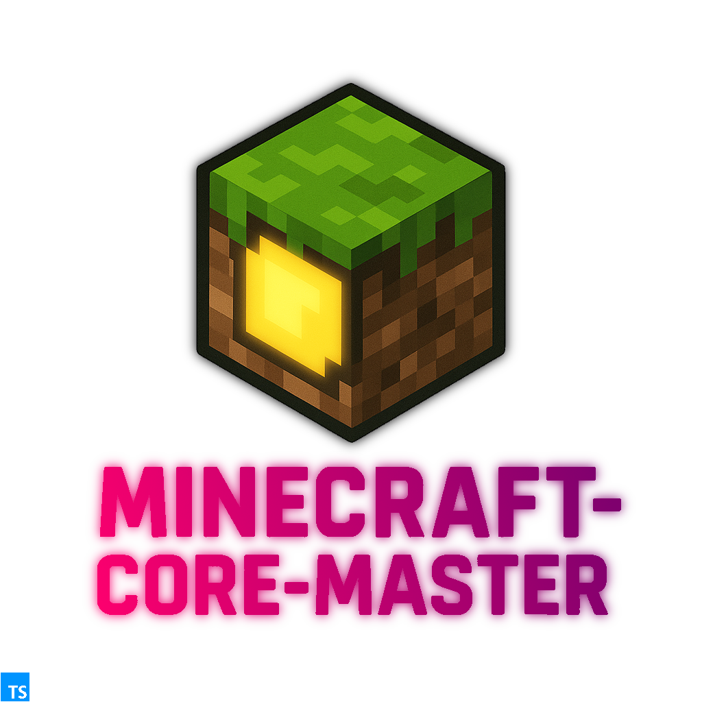
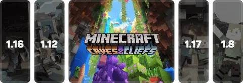
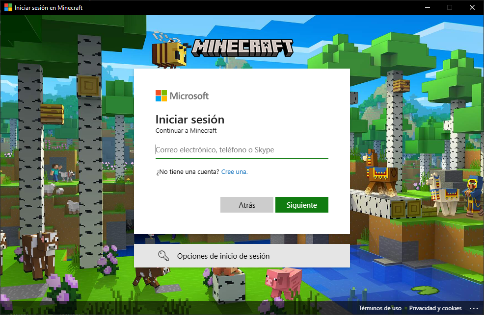

[](https://www.npmjs.com/package/minecraft-core-master)
[](https://www.apache.org/licenses/LICENSE-2.0)

# Minecraft-Core-Master

**Minecraft-Core-Master** es una **librería modular** escrita en **TypeScript** (con soporte completo para **JavaScript**) que permite descargar Minecraft, crear instancias, gestionar loaders y ejecutar cualquier versión directamente desde los servidores oficiales de Mojang. Gracias a su arquitectura basada en **eventos**, es ideal para integrarse en **launchers personalizados** (como los desarrollados en **Electron**), ofreciendo retroalimentación en tiempo real sobre progreso, errores y estado de ejecución, para una experiencia visual y control total del flujo de instalación y ejecución.

Desarrollado por **NovaStep Studios** con un enfoque en rendimiento, control total, personalización y compatibilidad total con versiones *legacy*, *modernas* y con Loaders populares.

---

¿Tienes dudas o quieres charlar con la comunidad?  
Únete a nuestro [Discord Oficial](https://discord.gg/YAqpTWQByM) y recibe ayuda rápida, noticias y tips directamente de otros usuarios o de **``Stepnicka!``**.  

<p align="center">
  <a href="https://discord.com/invite/BpqC88ZN">
    
  </a>
</p>

---

<!-- Documentacion / Docs : [Minecraft-Core-Master-Docs](https://minecraft-core-master.web.app/) -->
### **Apoyar**
Mercado Pago :
 - CVU : 0000003100051190149138
 - Alias : stepnickasantiago


## **Instalacion**

**``npm i minecraft-core-master``**

**``yarn add minecraft-core-master``**

**``pnpm add minecraft-core-master``**

Dependencias que utiliza : **p-limit, prompt, semver**
## **Componentes principales**


### **`MinecraftDownloader`**



Clase que descarga todos los recursos necesarios para ejecutar Minecraft:

* ► Java Runtime (JVM) oficial o personalizado.
* ► Librerías del juego.
* ► Assets/Resources (texturas, sonidos, fuentes, etc.).
* ► Cliente ( `client.jar` ).
* ► Archivos nativos específicos para tu sistema operativo.

#### 🧪 Uso básico

```js
const { MinecraftDownloader } = require("../dist/index");

async function main() {
  const downloader = new MinecraftDownloader();

  // Escuchar progreso global
  downloader.on("progress", ({ current, stepPercent, totalPercent }) => {
    console.log(`[PROGRESO] ${current} | Progreso: ${stepPercent}% | Total: ${totalPercent}%`);
    });

  // Escuchar cuando un paso termina
  downloader.on("step-done", (name) => {
    console.log(`[COMPLETADO] ${name}`);
  });

  // Advertencias
  downloader.on("warn", (msg) => {
    console.warn(`[ADVERTENCIA] ${msg}`);
  });

  // Errores
  downloader.on("error", (err) => {
    console.error(`[ERROR] ${err.message}`);
  });

  // Información general
  downloader.on("info", (msg) => {
    console.log(`[INFO] ${msg}`);
  });

  // Cuando todo el proceso finalice
  downloader.on("done", () => {
    console.log(`✅ Descarga completa de todos los componentes de Minecraft!`);
  });

  // Iniciar descarga
  await downloader.start({
    root:".minecraft",
    version:"1.12.2",
    concurrency:false, // False = Descargar 1 x 1 | Number "Ej. 2" Descargara de 2 en 2 ( 2 x 1 )
    installJava: false, /** Descarga de Java Ej. "22", "17", "etc" */ // https://launchermeta.mojang.com/v1/products/java-runtime/2ec0cc96c44e5a76b9c8b7c39df7210883d12871/all.json
    variantJava: "release", // Snapshot | Alpha | Legacy | Beta
    bundle: true
  });
}

main().catch(console.error);
### ⚙️ Parámetros de `MinecraftDownloader.start(opts)`
```

| Parámetro     | Tipo                | Descripción                                                                                           | Ejemplo                                |
|---------------|---------------------|-------------------------------------------------------------------------------------------------------|----------------------------------------|
| `root`        | `string`            | Carpeta raíz donde se almacenarán todos los datos de Minecraft.                                       | `"./.minecraft"`                        |
| `version`     | `string`            | Versión de Minecraft a descargar e instalar.                                                          | `"1.12.2"`, `"1.20.1"`                  |
| `concurrency` | `boolean \| number` | Controla el modo de descarga: `false` = archivos 1x1, `number` = cantidad de descargas en paralelo.   | `false`, `2`, `5`                       |
| `installJava` | `boolean \| string` | Si es `false`, no descarga Java. Si es un número o string, descarga esa versión específica de Java.   | `false`, `"17"`, `"22"`                 |
| `variantJava` | `string`            | Variante de Java a instalar.                                                                          | `"release"`, `"snapshot"`, `"beta"`     |
| `bundle`      | `boolean`           | Si es `true`, descarga e instala todo en un solo paquete (optimizado).                               | `true`, `false`                         |

---

### 📡 Eventos disponibles

| Evento        | Datos recibidos                         | Descripción                                                                 |
|---------------|------------------------------------------|-----------------------------------------------------------------------------|
| `progress`    | `{ current, stepPercent, totalPercent }` | Progreso en tiempo real de cada paso y total de la descarga.                |
| `step-done`   | `string`                                 | Nombre del paso completado (ej: `"assets"`, `"libraries"`, `"client"`).     |
| `warn`        | `string`                                 | Mensaje de advertencia durante la instalación.                              |
| `error`       | `Error`                                  | Error crítico que detiene la descarga.                                      |
| `info`        | `string`                                 | Información adicional útil para debug o seguimiento.                        |
| `done`        | `void`                                   | Evento emitido cuando **todo** el proceso finaliza correctamente.           |

---
<!-- 
### **`MinecraftLoaders`**

Instala modloaders como **Forge**, **OptiFine**, **NeoForge**, **Quilt**, **Fabric**, sobre una instalación existente de Minecraft.

#### 📦 Ejemplo de uso

```js
const {MinecraftLoaders} = require('minecraft-core-master');

const installer = new MinecraftLoaders().neoforge({
  root: '.minecraft',        // Ruta a la carpeta raíz
  version: '21.4.0-beta'     // Versión de NeoForge
});

installer.on('data', (msg) => {
  console.log(`[NeoForge] ${msg}`);
});

installer.on('done', () => {
  console.log("✅ NeoForge instalado correctamente.");
});

installer.on('error', (err) => {
  console.error("❌ Error durante la instalación:", err);
});
```

```js
const {MinecraftLoaders} = require('minecraft-core-master');

new MinecraftLoaders().forge({
  root: './.minecraft',
  version: '1.16.5-36.2.20',
})
  .on('data', (msg) => {
    console.log(`[Forge] Progreso: ${msg.progress}/${msg.total}`);
  })
  .on('done', () => {
    console.log('[Forge] Instalación completada');
  })
  .on('error', console.error);
```
### ¿Como Obtener versiones?
```js
const { MinecraftLoaders } = require('minecraft-core-master');

const Loader = new MinecraftLoaders().getVersions({
  type:'forge' // Fabric, LegacyFabric, Quilt, Forge, NeoForge
  }).on('data',(msg) =>{
    console.log(msg);
});
```
Otros modloaders: Fabric, LegacyFabric, Quilt, Neoforge.

Puedes ver ejemplos en la carpeta de pruebas:
[TestLoaders](https://github.com/NovaStepStudios/Minecraft-Core-Master/tree/main/test/Loaders)

#### ℹ️ Notas

* La carpeta `root` debe contener una instalación válida de Minecraft.
* Requiere **Java en PATH** para instalar Forge.
* No descarga Minecraft base, solo inyecta el modloader deseado. -->

---

### **`MinecraftLauncher`**


Clase que permite **lanzar Minecraft** con control total: configuración de memoria, ruta Java, ventana, argumentos, y sistema de logs y errores con persistencia.

```js
const { MinecraftLauncher, Mojang } = require('minecraft-core-master');

(async () => {
  // Autenticación (offline en este ejemplo)
  const user = await Mojang.login("Stepnicka012");
  console.log(user); // Debug de usuario

  const launcherOptions = {
    version: '1.21.5',                // Versión de Minecraft [ Selecciona automaticamente el tipo de version ]
    root: './.minecraft',             // Carpeta raíz
    javaPath: 'C:/Program Files/Java/jdk-21/bin/javaw.exe',
    
    jvmArgs: [],   // Argumentos JVM opcionales
    mcArgs: [],    // Argumentos del cliente opcionales
    demo: false,   // Activar modo demo
    debug: false,  // Activar logs de depuración

    memory: {      // Configuración de RAM
      min: "512M",
      max: "2G"
    },

    authenticator: user,  // Objeto devuelto por Mojang/Microsoft/etc.

    window: {      // Opciones de ventana
      width: "854", // Number
      height: "480", // Number
      fullscreen: false // True
    }
  };

  const launcher = new MinecraftLauncher(launcherOptions);

  // Escuchar eventos
  launcher.on('debug', (msg) => console.log('[DEBUG]', msg));
  launcher.on('warn', (msg) => console.warn('[WARN]', msg));
  launcher.on('error', (err) => console.error('[ERROR]', err));
  launcher.on('data', (msg) => console.log('[DATA]', msg));

  try {
    await launcher.launch();
    console.log("✅ Minecraft lanzado correctamente!");
  } catch (err) {
    console.error("❌ Falló el lanzamiento:", err);
  }
})();
```

| Parámetro           | Tipo              | Descripción                                                                                | Ejemplo                                        |
| ------------------- | ----------------- | ------------------------------------------------------------------------------------------ | ---------------------------------------------- |
| `version`           | `string`          | Versión de Minecraft a ejecutar.                                                           | `"1.21.5"`, `"1.20.1"`                         |
| `loader`            | `string`          | Loader a ejecutar (Forge, Fabric, NeoForge, etc.).                                         | `"1.21.5-forge-55.0.24"`                       |
| `root`              | `string`          | Carpeta raíz de `.minecraft`.                                                              | `"./.minecraft"`                               |
| `javaPath`          | `string`          | Ruta al ejecutable de Java (`javaw.exe` o `java`).                                         | `"C:/Program Files/Java/jdk-21/bin/javaw.exe"` |
| `jvmArgs`           | `string[]`        | Argumentos adicionales para la JVM (rendimiento, debug, compatibilidad).                   | `["-XX:+UseG1GC"]`                             |
| `mcArgs`            | `string[]`        | Argumentos adicionales para Minecraft.                                                     | `["--fullscreen"]`                             |
| `demo`              | `boolean`         | Activa el modo demo de Minecraft.                                                          | `false`                                        |
| `debug`             | `boolean`         | Activa logs de depuración detallados.                                                      | `true`                                         |
| `memory.min`        | `string`          | Memoria mínima asignada a la JVM.                                                          | `"512M"`, `"1G"`                               |
| `memory.max`        | `string`          | Memoria máxima asignada a la JVM.                                                          | `"2G"`, `"8G"`                                 |
| `authenticator`     | `object`          | Objeto devuelto por autenticadores (`Mojang`, `Microsoft`, `AZauth`, etc.).                | `{ access_token, uuid, name, ... }`            |
| `window.width`      | `number`  | Ancho de ventana.                                | `854`                                         |
| `window.height`     | `number`  | Alto de ventana.                                                                           | `480`                                          |
| `window.fullscreen` | `boolean \| null` | Define si se inicia en pantalla completa. `null` = configuración por defecto de Minecraft. | `true`                                         |

---

### Login Con Mojang


```js
const { Mojang } = require('minecraft-core-master');

async function MojangLogin() {
  try {
    // Login con nombre de usuario Mojang
    const user = await Mojang.login("Stepnicka012");
    console.log(user);

    /**
     * Ejemplo de objeto devuelto:
     * {
     *   access_token: '3cb84f07461800a947dffb283de26ac7',
     *   client_token: '3cb84f07461800a947dffb283de26ac7',
     *   uuid: '3cb84f07461800a947dffb283de26ac7',
     *   name: 'Stepnicka012',
     *   user_properties: '{}',
     *   meta: { online: false, type: 'Mojang' }
     * }
     */
  } catch (err) {
    console.error("❌ Error al hacer login con Mojang:", err);
  }
}

MojangLogin();
```
| Campo             | Tipo     | Descripción                                                  |
| ----------------- | -------- | ------------------------------------------------------------ |
| `access_token`    | `string` | Token de acceso para iniciar sesión y ejecutar Minecraft.    |
| `client_token`    | `string` | Token de cliente generado durante la autenticación.          |
| `uuid`            | `string` | UUID único del usuario.                                      |
| `name`            | `string` | Nombre de usuario autenticado.                               |
| `user_properties` | `string` | JSON con propiedades adicionales del usuario.                |
| `meta`            | `object` | Información adicional: `{ online: boolean, type: 'Mojang' }` |

---

### Login Con Microsoft
```js
const { Microsoft, MinecraftLauncher } = require('minecraft-core-master');

(async () => {
  try {
    // 1️⃣ Instancia de Microsoft
    const ms = new Microsoft(''); // Client ID opcional

    // 2️⃣ Login interactivo (terminal/electron)
    const auth = await ms.getAuth('terminal');
    if (!auth || auth.error) {
      console.error('❌ Login falló:', auth?.error ?? 'cancelado');
      return;
    }
    console.log('✅ Login exitoso:', auth.name);

    // 3️⃣ Obtener perfil de Minecraft
    const profile = await ms.getProfile({ access_token: auth.access_token });
    if ('error' in profile) {
      console.error('❌ Error obteniendo perfil:', profile.error);
      return;
    }

    console.log('Perfil Minecraft:', profile.name);
    console.log('Skins disponibles:', profile.skins.length);
    console.log('Capes disponibles:', profile.capes.length);

    // 4️⃣ Preparar autenticador para MinecraftLauncher
    const userData = {
      access_token: auth.access_token,
      client_token: auth.client_token ?? auth.uuid,
      uuid: profile.id,
      name: profile.name,
      user_properties: '{}',
      meta: { online: true, type: 'msa' },
    };

    // 5️⃣ Lanzar Minecraft (ejemplo 1.20.1)
    const launcher = new MinecraftLauncher({
      version: '1.20.1',
      root: './.minecraft',
      javaPath: 'java',
      authenticator: userData,
      memory: { min: '2G', max: '4G' },
      window: { width: 1280, height: 720, fullscreen: false },
    });

    launcher.on('progress', console.log);
    launcher.on('info', console.log);
    launcher.on('warn', console.warn);
    launcher.on('error', console.error);
    launcher.on('data', (child) => {
      child.on('close', code => console.log('Minecraft cerrado con código:', code));
    });

    await launcher.launch();
  } catch (err) {
    console.error('❌ Error fatal:', err);
  }
})();
```

### Obtener datos de Usuario ( Microsoft )
```js
const { Microsoft } = require("minecraft-core-master");

async function main() {
  const ms = new Microsoft();

  console.log("Iniciando login con Microsoft...");

  // Intentamos login (terminal, electron o nwts según tu entorno)
  const auth = await ms.getAuth("electron");

  if (!auth || "error" in auth) {
    console.error("❌ Error al autenticar:", auth);
    return;
  }

  console.log("✅ Login correcto!");
  console.log("Access Token:", auth.access_token.substring(0, 20) + "...");
  console.log("Gamertag:", auth.xboxAccount.gamertag);
  console.log("UUID:", auth.uuid);
  console.log("Nombre:", auth.name);

  console.log("\nPerfil de Minecraft:");
  console.log("ID:", auth.profile.id);
  console.log("Nombre:", auth.profile.name);

  if (auth.profile.skins.length > 0) {
    console.log("Skins:", auth.profile.skins.map(s => s.url));
  } else {
    console.log("Sin skins 😢");
  }

  if (auth.profile.capes.length > 0) {
    console.log("Capes:", auth.profile.capes.map(c => c.url));
  } else {
    console.log("Sin capas 🦸");
  }
}

main().catch(err => console.error("💥 Error fatal:", err));
```

| Campo             | Tipo   | Descripción                            |
| ----------------- | ------ | -------------------------------------- |
| `access_token`    | string | Token de sesión devuelto por Microsoft |
| `client_token`    | string | Token de cliente (fallback UUID)       |
| `uuid`            | string | UUID real de la cuenta                 |
| `name`            | string | Nombre del jugador                     |
| `user_properties` | string | JSON adicional para el juego           |
| `meta`            | object | `{ online: boolean, type: 'msa' }`     |

---

### Login con autenticador personalizado (AZauth / servidor propio)

```js
const { MinecraftLauncher, AZauth } = require('minecraft-core-master');
const path = require('path');

// ---------------- CONFIG ----------------
const GAME_DIR = path.resolve('./.minecraft');
const VERSION = '1.12.2';
const JAVA_PATH = 'java'; // O ruta completa a tu JDK/JRE
// ---------------------------------------

(async () => {
  try {
    console.log('Iniciando launcher...');

    // 1️⃣ Login con AZauth
    const azAuthInstance = new AZauth('https://tuservidor.com'); // URL de tu servidor
    const azUser = await azAuthInstance.login('username', 'password');
    
    if (azUser.error) {
      console.error('❌ Error AZauth:', azUser.reason, azUser.message);
      return;
    }
    console.log('✅ Login AZauth exitoso:', azUser.name);

    // 2️⃣ Configuración del launcher
    const launcher = new MinecraftLauncher({
      version: VERSION,
      gameDir: GAME_DIR,
      javaPath: JAVA_PATH,
      authenticator: azUser, // Pasar directamente el objeto AZauth
      memory: { min: '1G', max: '4G' },
      screen: { width: 1280, height: 720 },
    });

    // 3️⃣ Eventos
    launcher.on('info', (msg) => console.log('[INFO]', msg));
    launcher.on('progress', (msg) => console.log('[PROGRESS]', msg));
    launcher.on('warn', (msg) => console.warn('[WARN]', msg));
    launcher.on('error', (err) => console.error('[ERROR]', err));
    launcher.on('data', (child) => {
      console.log('[DATA] Minecraft listo para ejecutar');
      child.on('close', (code) => console.log('Minecraft cerrado con código:', code));
    });

    // 4️⃣ Lanzar Minecraft
    await launcher.launch();

  } catch (err) {
    console.error('❌ Falló el lanzamiento:', err);
  }
})();

```

| Campo / Objeto                  | Tipo              | Descripción                                                                                    |
| ------------------------------- | ----------------- | ---------------------------------------------------------------------------------------------- |
| `AZauth.login(username, password)` | `Promise<object>` | Autenticación contra tu servidor AZauth. Devuelve un objeto compatible con `authenticator`.    |
| `authenticator`                 | object            | Objeto devuelto por AZauth que se pasa directamente a `MinecraftLauncher` para iniciar sesión. |

---

> **Nota:** Este proyecto soporta el lanzamiento y gestión de **todas las versiones oficiales de Minecraft**, desde las más recientes hasta las más antiguas, incluyendo snapshots, betas, alphas y versiones históricas como la legendaria **rd-132211**. No importa qué tan vintage o moderna sea la versión, Minecraft-Core-Master la ejecutará con total estabilidad y rendimiento.

---

### 📁 Gestión avanzada de logs y errores

* Los logs críticos y reportes de fallos se almacenan automáticamente en la carpeta `root/logs` bajo archivos con prefijo `minecraft-core-master*.log`, permitiendo una inspección detallada para diagnósticos rápidos y precisos.
* Toda la salida estándar (`stdout`) y salida de error (`stderr`) del proceso Minecraft se expone en tiempo real a través de eventos, lo que facilita la integración con GUIs personalizadas, consolas o herramientas de monitoreo remoto.
* La arquitectura basada en eventos permite capturar errores de manera proactiva y reaccionar ante ellos sin bloquear el flujo del programa, garantizando una experiencia estable para el usuario final.

---

## 📜 Scripts de prueba y demostración (github)

Incluimos ejemplos robustos en la carpeta `test/` para que puedas probar cada componente de forma independiente o integrada. Estos scripts incluyen manejo de eventos detallado, seguimiento de progreso y captura de errores:

```bash
node test/Download.js      # Descarga y prepara cualquier versión de Minecraft con validación.
node test/Start.js        # Ejecuta Minecraft con configuración avanzada y monitoreo. En Mantenimiento
```

Estos ejemplos sirven tanto para pruebas rápidas como para entender cómo extender o integrar Minecraft-Core-Master en tus proyectos.


---

## 🧪 Características técnicas sobresalientes

* ► **Descarga Oficial y Segura:** Todos los archivos se obtienen directamente de los servidores de Mojang, con **validación por hash**, asegurando integridad y confiabilidad absoluta.

* ► **Compatibilidad total con versiones oficiales:** Soporte completo para **todas las versiones de Minecraft**, incluyendo snapshots, betas, alphas, versiones históricas y cualquier versión custom que cumpla con el estándar oficial.

* ► **Soporte completo para modloaders y clientes custom:** Compatible con **Forge, Fabric, NeoForge, Optifine, Quilt, Battly Client y BatMod**, permitiendo ejecutar prácticamente cualquier configuración de Minecraft.

* ► **Arquitectura modular y extensible:** Componentes diseñados para ser **reutilizables y escalables**, listos para integrarse en launchers personalizados o proyectos propios, con **documentación completa y eventos claros**.

* ► **Eventos en tiempo real:** Feedback dinámico de progreso, errores, advertencias e información mediante `EventEmitter`, ideal para **interfaces gráficas, consolas o sistemas de monitoreo**.

* ► **Multiplataforma real:** Comprobado en **Windows, Linux y macOS**, con **manejo automático de archivos nativos** y rutas Java, garantizando ejecución sin problemas en cualquier sistema.

* ► **Control avanzado de ejecución de Minecraft:** Configuración completa de **memoria JVM, argumentos del juego, ventana, logs y depuración**, incluyendo persistencia de errores y salida en tiempo real.

* ► **Autenticación flexible:** Compatible con **Mojang, Microsoft y AZauth**, permitiendo login offline, online y servidores propios, con manejo seguro de tokens y perfiles.

* ► **Gestión de logs y errores profesional:** Registros críticos almacenados automáticamente en `root/logs`, capturando stdout/stderr en tiempo real para **diagnósticos precisos y control total del flujo del juego**.

* ► **Optimización y rendimiento:** Descargas en paralelo, instalación de Java opcional, y **bundle completo de componentes**, garantizando procesos rápidos y confiables.

* ► **Extensibilidad para desarrolladores:** Ideal para integrar en **Electron, React o cualquier launcher personalizado**, con eventos y API claros que facilitan la construcción de herramientas avanzadas para Minecraft.

* ► **Compatibilidad histórica:** Capaz de lanzar versiones legendarias y modernas, desde **rd-132211** hasta las más recientes, con estabilidad y rendimiento garantizado.

---

## 🏢 Acerca de NovaStep Studios

**Minecraft-Core-Master** nace de la pasión y dedicación de **Santiago Stepnicka (Stepnicka)**, un desarrollador fullstack enfocado en **software libre, modularidad y excelencia técnica**. Cada línea de código está pensada para ofrecer **rendimiento, estabilidad y control total** sobre Minecraft.

🎯 **Nuestra misión:** Empoderar a desarrolladores y comunidades con herramientas **profesionales, robustas y abiertas**, transformando la forma en que se juega y se lanza Minecraft. Creemos que **Minecraft debe ser una experiencia fluida, personalizable y sin complicaciones**, desde la instalación hasta el modding avanzado.

🚀 **¿Querés llevar tu launcher al siguiente nivel?**
Si buscás crear un **launcher personalizado**, integrar sistemas complejos en **React/Electron**, añadir soporte avanzado de **modloaders** o desarrollar herramientas únicas, en **NovaStep Studios** te damos todo el soporte y ejemplos que necesitás para lograrlo.

✨ **Con Minecraft-Core-Master, las posibilidades son infinitas. Tu creatividad es el límite.**

<p align="center">
  
</p>